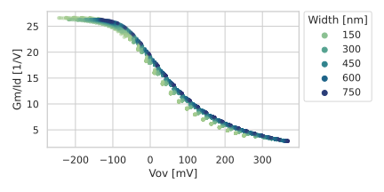

#   Cadence Plotting Utility

Zephan M. Enciso  
Intelligent MicroSystems Lab  



##  Dependencies

These utilities have been tested with the following software versions:
  - `python` == 3.9.7
  - `matplotlib` == 3.5.1
  - `jedi` == 0.18.1
  - `scipy` == 1.8.0
  - `numpy` == 1.22.2
  - `pandas` == 1.4.0

##  Usage

From the waveform viewer, export your data as a `.csv` file.  Make sure to
enable the "Interpolate" option so each waveform has the same time axis.  Then,
invoke the main script as follows:

```
./cadence_plot.py [OPTIONS] PLOT INPUT [kwargs]
    -h  --help      Display this message
    -v  --verbose   Enable verbose output
    -s  --summary   Feed in summary data instead of a waveform

    PLOT is the plot you wish to create, defined in `plot_functions.py`:
    gmid
    inputrefnoise
    replot
    ...

INPUT is the input data file, e.g. `data/my_data.csv`.
If no input and kwargs are given, prints the usage for the given PLOT.
```

This script can also do plotting with Maestro summary data instead of a
waveform.  In this case, use the `-s` or `--summary` switch and ensure that the
selected plotting function supports it.

To provide a multi-word kwarg, either enclose the entire kwarg definition in
quotes or just the value, e.g.:

```
./cadence_plot.py replot 'data.csv' 'xlabel=Time [s]'
OR
./cadence_plot.py replot 'data.csv' xlabel='Time [s]'
```

### Replot

The most versatile of the plotting functions is `replot`, which accepts either a
waveform **or** summary data and plots arbitrary axes.  `replot` supports
several Seaborn plot styles, including lineplots, scatterplots, histograms, kde
plots, and even some combinations (like histograms with kde, invoked with any
string that contains both `hist` _and_ `kde`).  Most of the Seaborn settings are
exposed with the kwargs listed below:

```
./cadence_plot.py replot [-s] INPUT [kwargs]

Data
    x=str                       Change x (default: first column)
    y=str                       Change y (default: second column)
    hue=str         h=str       Specify hue (WARNING default: None)
    style=str       s=str       Specify style (default: None)
    size=str                    Specify size (default: None)
    xscale=float    xs=float    Rescale x axis (default: 1)
    yscale=float    ys=float    Rescale y axis (default: 1)
    hscale=float    hs=float    Rescale hue (default: 1)
    sscale=float    ss=float    Rescale style (default: 1)
Figure
    figsize=tuple   fs=tuple    Change figsize (default: '6,3')
    xlabel=str      xl=str      Change x axis label (default: x)
    ylabel=str      yl=str      Change y axis label (default: y)
    ltitle=str      lt=str      Change legend title (default: automatic)
    axes=str        ax=str      Change axes style (default: 'whitegrid')
    context=str     cx=str      Scale plot elements (default: 'notebook')
    logx=bool       lx=bool     Enable/disable log for x-axis (default: False)
    logy=bool       ly=bool     Enable/disable log for y-axis (default: False)
    bbox=bool       bb=bool     Enable/disable bbox for legend (default: True)
    xlim=tuple                  Change xlim (default: full range)
    ylim=tuple                  Change ylim (default: full range)
Drawing
    width=float     w=float     Change marker or line width (default: Depends)
    alpha=float     a=float     Change alpha (default: 0.5)
    palette=str     c=str       Palette, accepts cubehelix (default: 'crest')
    ptype=str       pt=str      Change the plot type (default: 'line')
    ci=float                    Change confidence interval size (default: 95)
    stat=str                    Change stat/estimator (default: Depends)
    bins=int                    Change number of bins/levels (default: 10)
    fill=bool                   Enable/disable fill (default: Depends)
    multiple=str                Change multiple behavior (default: 'layer')
File
    filetype=str    ft=str      Change filetype (default: 'svg')
    filename=str    fn=str      Custom filename
```

##  Writing Additional Plot Functions

Each new plot function should be defined in a different file in the
`plot_functions` directory.  This file must have a function called `plot` with
two mandatory arguments: `df`, the input Pandas DataFrame, and `kwargs`, which
is a list of additional arguments passed to the function.  This file must also
have a function called `usage` with no arguments.

```python
# Other function defs here

def usage():
    print('Interesting things about this program')

def plot(df, kwargs):
    sns.lineplot(...)
```

It is also possible to **call other plot functions**.  For example, using
`replot` is a convenient way to draw line plots without re-parsing the kwargs.

```python
from plot_functions import replot

df_new = # Some DataFrame transformations here
kwargs += ['hue=my_new_metric', 'ptype=scatter']

plot(df_new, kwargs)
```

It is **recommended**, though not required, to expect each additional argument
to be of the form `key=value`, which makes parsing the `kwargs` trivial.  For
example:

```
./cadence_plot.py replot path/to/data.csv filetype=png logx=true hue=Vov
```

```python
kwargs = ['filetype=png', 'logx=true', 'hue=Vov']

param = dict(
    # Default values
    )

for arg in kwargs:
    key, value = arg.split('=')
    if key in param:
        param[key] = value

```
